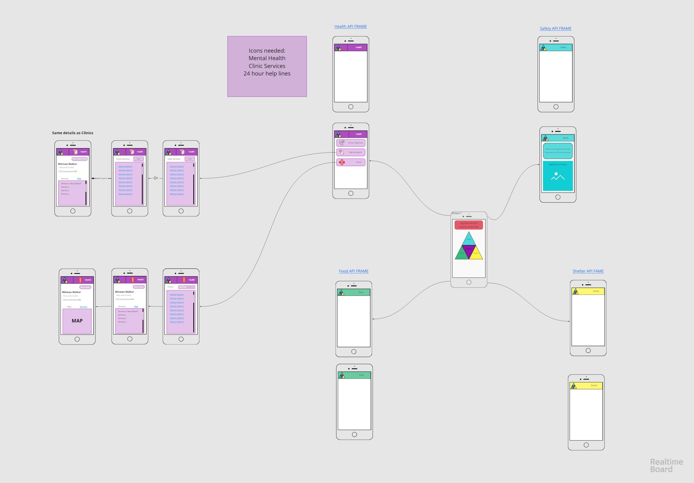

# This is still a work in progress. 

# This is a free projected intedned to be a PWA for those experiencing homelessness.
#### This utilizes specificly the Washington DC Government API's available. 

#### Goal: Keep things modular so that this can act as a potential model or template for projects in other locals. 

## Current Planned Dependancies: 

* react-router
* react-router-dom
* redux
* react-redux
* redux-thunk
* semantic-ui-react
* mapbox-gl

## Menu READMEs 
* [Health Menu and APIs](./AdditionalREADME/HealthREADME.md) 
* [Food Menu and APIs](./AdditionalREADME/FoodREADME.md) 
* [Shelter Menu and APIs](./AdditionalREADME/ShelterREADME.md) 

## Wireframe as of 1/20/19
 
