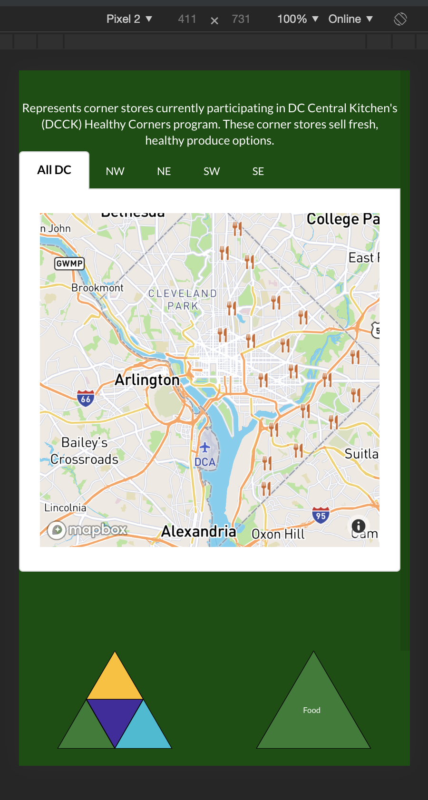

# This is still a work in progress - see notes section for the todo's. 
### Current version deployed on [Heroku](https://werhere.herokuapp.com/)

# This is a free project intedned to be a PWA for those experiencing homelessness.
#### This utilizes specificly the Washington DC Government API's available. 

#### Goal: Keep things modular so that this can act as a potential model or template for projects in other locals. 

## Directions: 
* clone down repo 
* Add a Mapbox Api Key to `.envExample` and rename the file to `.env` (this is already in the gitignor) 
* NPM install 
* `npm run startDev` for local environment

### notes to work on: 
    * current CSS is designed for a smartphone sized viewport and is minimal at present.

## Current Planned Dependancies: 

* react-router
* react-router-dom
* redux
* react-redux
* redux-thunk
* semantic-ui-react
* mapbox-gl

## Menu READMEs 
* [Health Menu and APIs](./AdditionalREADME/HealthREADME.md) 
* [Food Menu and APIs](./AdditionalREADME/FoodREADME.md) 
* [Shelter Menu and APIs](./AdditionalREADME/ShelterREADME.md) 
* [Services Menu and APIs](./AdditionalREADME/ServicesREADME.md) 

## Wireframe as of 6/1/19
 

## Actual screen shots of application 8/13/19
 
 

 
 